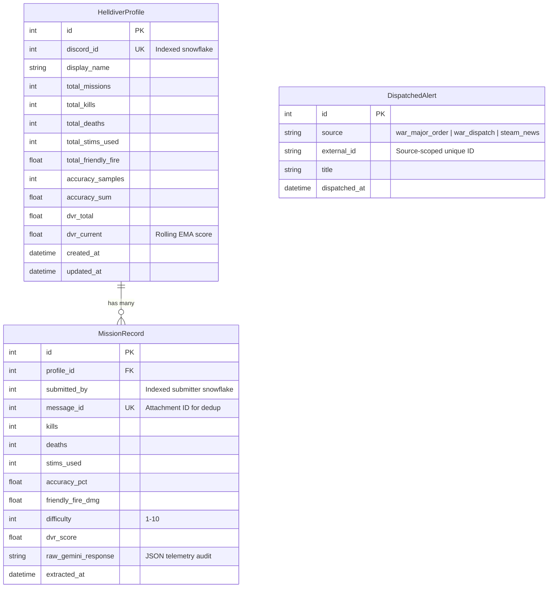

# ARCHITECTURE.md — Helldivers 2 Democratic Bot

> **Version:** 2.0.0  
> **Runtime:** Python 3.12+ · discord.py 2.x · google-genai SDK · SQLModel (aiosqlite / SQLite WAL)  
> **Last Updated:** 2026-09-13  

---

## 1. System Topology

```mermaid
graph TB
    subgraph "Discord Client & Gateway"
        GW["Discord Gateway\n(WebSockets)"]
        HC["#helldivers Channel\n(HELLDIVER_CHANNEL_ID)"]
        SC["Slash Commands\n(/war, /major_order, /debrief, /stats, /stratagem, /ask, /leaderboard, /profile)"]
    end

    subgraph "Bot Process (asyncio)"
        BOT["discord.py Client\n(HelldiversBot)"]

        subgraph "Command Controllers (Cogs)"
            WAR["WarCog\n(war.py)"]
            NEWS["NewsCog\n(news.py)"]
            WIKI["WikiCog\n(wiki.py)"]
            SB["ScoreboardCog\n(scoreboard.py)"]
        end

        subgraph "Presentation Layer (src/bot/ui)"
            MD["Markdown Utilities\n(markdown.py)"]
            W_UI["Wiki Embeds\n(wiki_embeds.py)"]
            S_UI["Scoreboard Embeds\n(scoreboard_embeds.py)"]
            WAR_UI["War Embeds\n(war_embeds.py)"]
            N_UI["News Embeds\n(news_embeds.py)"]
        end

        subgraph "Services Layer"
            HDS["HD2ApiClient\n(hd2_api.py)"]
            STS["SteamApiClient\n(steam_api.py)"]
            WKS["WikiClient\n(wiki_client.py)"]
            WKP["WikiParser\n(wiki_parser.py)"]
            WKM["WikiModels\n(wiki_models.py)"]
            DVR["DVR Engine\n(dvr.py)"]
            RETRY["Async Retry\n(_retry.py)"]
        end

        subgraph "AI Layer"
            PERS["MinistryPersona\n(persona.py)"]
            VIS["ScoreboardVisionExtractor\n(vision.py)"]
        end

        subgraph "Database Layer (SQLModel + WAL)"
            ENG["Async Engine\n(engine.py)"]
            MODELS["Schema Models\n(models.py)"]
            REPO["Repositories\n(repos.py)"]
        end
    end

    subgraph "External APIs & Intelligence Services"
        HDAPI["api.helldivers2.dev/api/v1\n(Fallbacks: diveharder mirror)"]
        STEAM["api.steampowered.com\nISteamNews (App ID 553850)"]
        GEMAPI["Gemini API\n(google-genai Client)"]
        WIKISITE["helldivers.wiki.gg\nMediaWiki Action API"]
    end

    subgraph "Persistent Storage"
        DB[("democracy.db\nSQLite WAL")]
        CACHE[("wiki_chunks/\nJSON Disk Cache")]
    end

    GW <-->|Events & Commands| BOT
    BOT --> WAR & NEWS & WIKI & SB

    WAR -->|Delegates Presentation| WAR_UI
    NEWS -->|Delegates Presentation| N_UI
    WIKI -->|Delegates Presentation| W_UI & MD
    SB -->|Delegates Presentation| S_UI

    WAR -->|Task Loops & Queries| HDS
    NEWS -->|Task Loops & Queries| STS
    WIKI -->|Search & Fetch| WKS
    WIKI -->|RAG Answers| PERS
    SB -->|Vision OCR| VIS
    SB -->|Commentary| PERS
    SB -->|Score Formulas| DVR

    WKS --> WKM & WKP
    WKS --> CACHE

    HDS -->|httpx| HDAPI
    STS -->|httpx| STEAM
    PERS -->|google-genai| GEMAPI
    VIS -->|google-genai| GEMAPI
    WKS -->|httpx| WIKISITE

    WAR & NEWS -->|Alert Embeds| HC
    SB -->|Debrief & Record Embeds| HC
    SC -->|Interactive Responses| BOT

    WAR & NEWS & SB --> REPO
    REPO --> ENG --> DB
```



---

## 2. Layered Architectural Blueprint

The application enforces strict **Separation of Concerns (SoC)**, **High Cohesion**, and **Low Coupling**:

| Layer | Module Path | Architectural Role & Public Interface |
|---|---|---|
| **Entry & Config** | `src/main.py` | Bootstraps logging, initializes database engine, starts bot lifecycle. |
| | `src/config.py` | Validates environment variables using `pydantic-settings`; provides typed `Settings` singleton with sync-guard and backward-compatible aliases. |
| **Bot & Controllers** | `src/bot/bot.py` | Custom `HelldiversBot` subclass with settings injection, extension loading in `setup_hook()`, and smart slash command tree sync. |
| | `src/bot/cogs/war.py` | Task loops for dispatches and Major Orders; slash commands `/war` and `/major_order`. |
| | `src/bot/cogs/news.py` | Task loop for Steam patch notes; deduplication and broadcasting. |
| | `src/bot/cogs/wiki.py` | Slash commands `/stratagem`, `/stats`, and `/ask`. Pure controller delegating to `WikiClient`, `MinistryPersona`, and `wiki_embeds`. |
| | `src/bot/cogs/scoreboard.py` | Slash commands `/debrief`, `/leaderboard`, `/profile`, and `/reset_leaderboard`. Pure controller with deterministic player ID resolution. |
| **Presentation (UI)** | `src/bot/ui/markdown.py` | Character-bounded safe markdown splitting (`safe_markdown_split`), tag balancing (`_get_unclosed_markdown_tags`), and header section parser. |
| | `src/bot/ui/wiki_embeds.py` | Formats specialized weapon dossiers, enemy anatomies, stratagem codes, and tactical Q&A multi-embed responses. |
| | `src/bot/ui/scoreboard_embeds.py` | Formats debrief extractions, squad summaries, Wall of Heroes leaderboards, and career dossiers. |
| | `src/bot/ui/war_embeds.py` | Formats galactic war status, planetary defense fronts, and resolves Major Order objectives and dynamic countdowns. |
| | `src/bot/ui/news_embeds.py` | Formats official Steam patch logs and announcements. |
| **AI Subsystem** | `src/ai/persona.py` | Ministry of Truth persona system prompts, Gemini generative chat, and debrief commentary sanitization. |
| | `src/ai/vision.py` | Gemini Flash structured vision extraction for end-of-mission scoreboards validated into Pydantic models. |
| **Services Layer** | `src/services/hd2_api.py` | Async client for Helldivers 2 Community API with in-memory caching and fallback mirror support. |
| | `src/services/steam_api.py` | Async client for Steam Web API patch filtering and BBCode parsing. |
| | `src/services/wiki_client.py` | Async client for MediaWiki OpenSearch/full-text search and disk caching. |
| | `src/services/wiki_parser.py` | CPU-bound BeautifulSoup DOM parsing for druid-infoboxes, tables, and directional arrows. |
| | `src/services/wiki_models.py` | Typed Pydantic models `WikiArticle` and `WikiSearchResult` with tactical dossier synthesis. |
| | `src/services/dvr.py` | Democratic Valor Rating (DVR) mission scoring formula and rolling Exponential Moving Average (EMA). |
| | `src/services/_retry.py` | Reusable async exponential backoff decorator. |
| **Database Layer** | `src/database/engine.py` | Async SQLite engine configured with PRAGMA WAL mode and foreign key enforcement. |
| | `src/database/models.py` | SQLModel schemas: `DispatchedAlert`, `HelldiverProfile`, `MissionRecord`. |
| | `src/database/repos.py` | Async CRUD repositories: `AlertRepository`, `ProfileRepository`, `MissionRepository`. |

---

## 3. Data Flow Pipelines

### 3.1 Galactic War & Steam News Polling Loop

```
┌────────────────────────────────────────────────────────────────────────┐
│  @tasks.loop(seconds=N)                                                │
│                                                                        │
│  1. Service.fetch_latest()        ← httpx GET (async, cached)          │
│  2. Deserialize → list[Model]     ← Pydantic validation                │
│  3. AlertRepository.is_dispatched() ← SELECT from dispatched_alerts   │
│  4. For each unsent item:                                              │
│     a. Build embed via src.bot.ui.(war_embeds | news_embeds)           │
│     b. channel.send(content=role_mention, embed=embed)                 │
│     c. AlertRepository.mark_dispatched() ← INSERT (idempotent)         │
│  5. Exceptions logged via log.exception(); loop resumes next cycle    │
└────────────────────────────────────────────────────────────────────────┘
```

### 3.2 Scoreboard Extraction (`/debrief image: [attachment] difficulty: [1-10]`)

```
┌───────────────────────────────────────────────────────────────────────────────┐
│  /debrief slash command interaction                                           │
│                                                                               │
│  1. Channel Guard: interaction.channel_id == helldiver_channel_id             │
│  2. Attachment Validation: image.content_type.startswith("image/")            │
│  3. Interaction Deferral: await interaction.response.defer(thinking=True)    │
│  4. Idempotency Check: MissionRepository.is_message_processed(image.id)       │
│  5. Image Byte Stream → ScoreboardVisionExtractor.extract_scoreboard()        │
│     └─ Gemini Flash structured JSON extraction into ScoreboardExtraction      │
│  6. For each extracted player:                                                │
│     a. calculate_mission_dvr() with difficulty multiplier (default: 1.0)      │
│     b. Resolve Discord user vs deterministic synthetic snowflake (MD5)        │
│     c. ProfileRepository.record_mission_stats()                               │
│     d. MissionRepository.create_mission_record()                               │
│  7. MinistryPersona.generate_debrief_commentary()                             │
│     └─ Sanitization pipeline strips leaked stat echoes & leaked math prompt   │
│  8. build_debrief_embed() via src.bot.ui.scoreboard_embeds                    │
│  9. await interaction.followup.send(embed=embed)                              │
└───────────────────────────────────────────────────────────────────────────────┘
```

### 3.3 Ministry Tactical Intelligence (`/ask question: [text]`)

```
┌────────────────────────────────────────────────────────────────────────┐
│  /ask slash command interaction                                        │
│                                                                        │
│  1. Cooldown Guard: 1 query per 15 seconds per user                    │
│  2. Entity Extraction: extract_wiki_entity() strips question fluff     │
│  3. WikiClient.search(entity) → OpenSearch + full-text fallback        │
│  4. WikiClient.get_article() → disk cache or fetch + wiki_parser       │
│  5. article.get_tactical_brief() builds targeted grounding context     │
│  6. MinistryPersona.answer_tactical_query() executes Gemini chat       │
│  7. build_tactical_embeds() parses sections & chunks under limits      │
│     └─ Narrative in embed.description (up to 4,096 chars)              │
│     └─ Sections in embed.fields (chunked safely to <= 1,024 chars)     │
│  8. await interaction.followup.send(embed=embed)                       │
└────────────────────────────────────────────────────────────────────────┘
```

---

## 4. Database Schema (SQLModel)

The database runs in SQLite **WAL mode** with foreign key constraints enabled.



---

## 5. Democratic Valor Rating (DVR) Specification

The DVR rewards effective combat performance, accuracy, and survivability while penalizing casualties and friendly fire:

### 5.1 Single-Mission Formula

$$
\text{DVR}_{\text{mission}} = D_m \times \left(
    w_k \cdot \min\!\left(\frac{K}{K_{\text{cap}}},\, 1\right)
    + w_a \cdot \frac{A}{100}
    + w_s \cdot S_{\text{score}}
    - w_d \cdot D_{\text{penalty}}
    - w_f \cdot F_{\text{penalty}}
\right)
$$

Where:
- $D_m = 0.5 + 0.5 \times \text{difficulty}$ (defaults to $1.0$ if difficulty is omitted)
- $w_k = 30.0$ (Kills weight, normalized to $K_{\text{cap}} = 500$)
- $w_a = 25.0$ (Accuracy weight, normalized to $100\%$)
- $w_s = 10.0$ (Support weight, $S_{\text{score}} = \max(1 - \text{stims}/20, 0)$)
- $w_d = 20.0$ (Casualties penalty, $D_{\text{penalty}} = \min(\text{deaths}/10, 1)$)
- $w_f = 15.0$ (Friendly fire penalty, $F_{\text{penalty}} = \min(\text{ff\_dmg}/500, 1)$)

### 5.2 Career Exponential Moving Average (EMA)

$$
\text{DVR}_{\text{current}} = \alpha \cdot \text{DVR}_{\text{mission}} + (1 - \alpha) \cdot \text{DVR}_{\text{previous}}
$$

Where $\alpha = 0.3$.

### 5.3 Career Patriotic Military Rank Tiers

| Tier Category | DVR Threshold | Canonical Military Title |
|---|---|---|
| **Enlisted / NCOs** | 0 – 24.9 | LINE HELLDIVER |
| | 25.0 – 49.9 | LANCE HELLDIVER |
| | 50.0 – 74.9 | CORPORAL HELLDIVER |
| | 75.0 – 99.9 | SERGEANT HELLDIVER |
| | 100.0 – 124.9 | STAFF SERGEANT HELLDIVER |
| | 125.0 – 149.9 | GUNNERY SERGEANT HELLDIVER |
| | 150.0 – 174.9 | MASTER SERGEANT HELLDIVER |
| | 175.0 – 199.9 | COMMAND SERGEANT HELLDIVER |
| **Commissioned Officers** | 200.0 – 229.9 | SECOND LIEUTENANT |
| | 230.0 – 259.9 | FIRST LIEUTENANT |
| | 260.0 – 299.9 | CAPTAIN HELLDIVER |
| | 300.0 – 349.9 | MAJOR HELLDIVER |
| | 350.0 – 399.9 | LIEUTENANT COLONEL HELLDIVER |
| | 400.0 – 449.9 | COLONEL HELLDIVER |
| **Marshals & High Command** | 450.0 – 499.9 | BRIGADIER MARSHAL |
| | 500.0 – 549.9 | MAJOR MARSHAL |
| | 550.0 – 599.9 | HIGH MARSHAL |
| | 600.0+ | SUPREME MARSHAL |

---

## 6. Rate Limiting, Caching & Resilience

| Service | Protocol / Endpoint | Default Poll / TTL | Caching & Retry Strategy |
|---|---|---|---|
| **Major Orders** | `/api/v1/assignments` | 4.5 min TTL (300s poll) | In-memory cache; fallback to `/major-orders` and dispatches. Retries $\times 3$. |
| **War Dispatches** | `/api/v1/dispatches` | 2.5 min TTL (300s poll) | In-memory cache; DB-level idempotency via `dispatched_alerts`. Retries $\times 3$. |
| **Campaigns** | `/api/v1/campaigns` | 4.5 min TTL (300s poll) | Primary API; fallback to `api.diveharder.com/v1/all_status`. Retries $\times 3$. |
| **Steam News** | `ISteamNews/v0002` (App 553850) | 9 min TTL (600s poll) | In-memory cache; DB-level idempotency. Retries $\times 3$. |
| **Wiki Intelligence** | MediaWiki Action API | 24 hour disk cache | OpenSearch + full-text query fallback; offloaded thread-pool DOM parsing. |
| **Gemini AI** | `google.genai` SDK | Per-interaction | Automatic fallback loop: `gemini-3.6-flash` $\rightarrow$ `gemini-3.5-flash` $\rightarrow$ `gemini-3.5-flash-lite` $\rightarrow$ `gemini-flash-latest`. Retries $\times 3$. |

---

## 7. Slash Command Manifest

| Command | Arguments | Clearance | Description |
|---|---|---|---|
| `/war` | None | All | Displays live Galactic War campaigns, defense fronts, and active liberation percentages. |
| `/major_order` | None | All | Displays active Major Order directives, target planet progress, dynamic countdown, and medal reward. |
| `/debrief` | `image: Attachment`, `difficulty: [1-10]` (optional) | All (Authorized Channel) | Submits end-of-mission extraction scoreboard for Gemini OCR telemetry and DVR calculation. |
| `/leaderboard` | `sort_by: ["dvr", "accuracy"]` | All | Displays top 10 Helldivers on the Super Earth Wall of Heroes. |
| `/profile` | `user: Member` (optional) | All | Displays career dossier, total extractions, kills, casualties, and DVR tier. |
| `/reset_leaderboard`| `confirm: bool` | Administrator Only | Complete administrative purge of all Helldiver dossiers and mission records. |
| `/stratagem` | `name: str` | All | Requisitions verified Stratagem codes, call-in times, cooldowns, and procurement costs. |
| `/stats` | `query: str` | All | Queries exhaustive tactical dossier on weapons, enemies, armor, boosters, or planets. |
| `/ask` | `question: str` | All (15s Cooldown) | Submits natural language tactical inquiry to the Ministry of Truth Tactical Terminal. |
